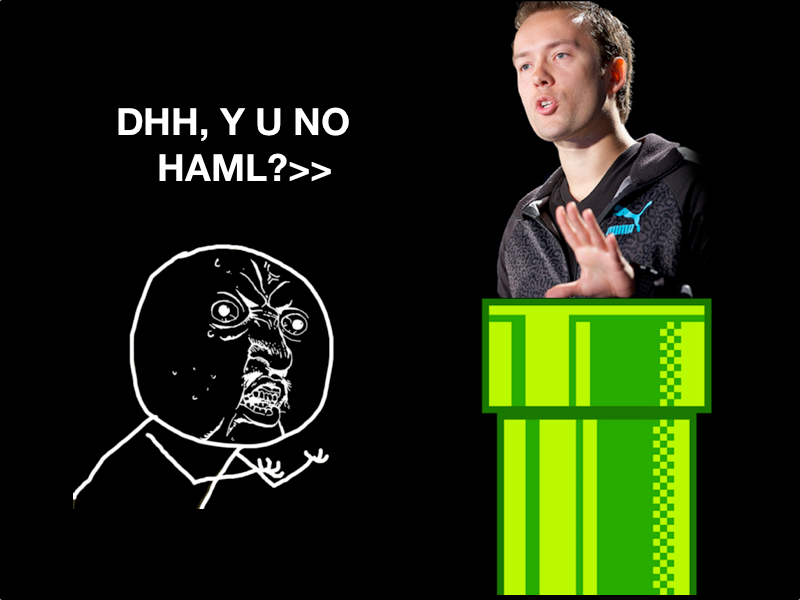

!SLIDE 
# Rails 3.1
## Tips from the Trenches

Tampa.rb
October 20th, 2011

!SLIDE

# @ambethia

!SLIDE smbullets incremental
# New in Rails 3.1

* New default dependencies
* HTTP streaming
* Self-reversing migrations
* SSL enforcement
* Scoped mass-assignment
* Secure password hashing

!SLIDE center
# The Asset Pipeline

!SLIDE bullets incremental
# In since Rails 3.0

* View Inheritance
* `ActiveSupport::Concern`
* Using `arel_table` directly

!SLIDE center
# New Defaults in Rails

!SLIDE bullets incremental
## jQuery has replaced Prototype.js

* `gem 'prototype-rails'`

!SLIDE bullets incremental
## Sass & CoffeeScript are included by default:

      @@@ ruby
      group :assets do
        gem 'sass-rails',   '~> 3.1.4'
        gem 'coffee-rails', '~> 3.1.1'
        gem 'uglifier', '>= 1.0.3'
      end

* Don't forget to add `'haml-rails'`
* More on all this later...

!SLIDE
# HTTP Streaming

      @@@ ruby
      respond_to :csv

      def index
        @data = Datum.all
        render :stream => true
      end

!SLIDE
# HTTP Streaming

      @@@ ruby
      respond_to :csv

      def index
        @data = Datum.all
        render stream: true
      end

!SLIDE commandline
## Without streaming:

    $ curl -I http://0.0.0.0:3000/data

    HTTP/1.1 200 OK 
    ...
    Content-Length: 9001

!SLIDE commandline
## With streaming:
    $ curl -I http://0.0.0.0:3000/data

    HTTP/1.1 200 OK 
    ...
    Transfer-Encoding: chunked

!SLIDE center
# Self-reversing Migrations

!SLIDE small

      @@@ ruby
      class CreateData < ActiveRecord::Migration

        def self.up
          create_table :data do |t|
            t.string :important_stuff
            t.timestamps
          end
        end

        def self.down
          drop_table :data
        end
      end

!SLIDE small

      @@@ ruby
      class CreateData < ActiveRecord::Migration

        def up
          create_table :data do |t|
            t.string :important_stuff
            t.timestamps
          end
        end

        def down
          drop_table :data
        end
      end

!SLIDE small

      @@@ ruby
      class CreateData < ActiveRecord::Migration

        def change
          create_table :data do |t|
            t.string :important_stuff
            t.timestamps
          end
        end
      end

!SLIDE small

      @@@ ruby
      class DropStuff < ActiveRecord::Migration

        def change
          remove_column :data, :important_stuff
        end
      end

## Not all migrations are created equal.

Raises `ActiveRecord::IrreversibleMigration` on `rake db:rollback`.

!SLIDE
# SSL Enforcement

!SLIDE small

      @@@ ruby
      VCFundedStartup::Application.configure do
        # ...
        config.force_ssl = true
      end

!SLIDE
# Scoped Mass-Assignment

!SLIDE

      @@@ ruby
      class User < ActiveRecord::Base
        attr_accessible :login
        attr_accessible :role, as: "admin"
      end

      @current_user.role # => "admin"

      @user = User.new({
        login: "admin",
         role: "moderator"
      },   as: @current_user.role)

      @user.role # => "moderator"

!SLIDE
# Secure Password Hashing

!SLIDE smbullets incremental

Everything but the kitchen sink:

* Devise
* Clearance
* Authlogic
* Restful-authentication
* `acts_as_authenticated`
* Other FOTM Libraries...

!SLIDE bullets incremental

Common best-practice defaults out of the box:

      @@@ ruby
      class User < ActiveRecord::Base
        has_secure_password
      end

* `password` attributes
* free validations (confirmation, presence)
* `User#authenticate`

!SLIDE bullets incremental
## But, my app is a beautiful and unique snowflake.

* ...so, roll your own.

!SLIDE smallest

      @@@ ruby
      attr_reader :password

      validates_presence_of :password_digest, unless: 'is_remotely_authenticatable?'

      def is_remotely_authenticatable?
        email =~ /@vcfundedstartup\.com$/
      end

      def password=(unencrypted_password)
        self.password_digest = BCrypt::Password.create(unencrypted_password)
      end

      def self.authenticate(email, password)
        employee = where(email: email).first
        if employee.is_remotely_authenticatable?
          employee if Google::ClientLogin.new(email, password).logged_in?
        else
          employee if BCrypt::Password.new(employee.password_digest) == password
        end
      end

!SLIDE
# The Asset Pipeline

!SLIDE
## Organization

!SLIDE small

      .
      ├── app
      │   └── assets
      │       ├── images
      │       │   └── rails.png
      │       ├── javascripts
      │       │   └── application.js.coffee
      │       └── stylesheets
      │           └── application.css.sass
      ├── lib
      │   └── assets
      │       └── fonts
      │           └── MavenPro.ttf
      └── vendor
          └── assets
              └── stylesheets
                  └── 960.css

!SLIDE smallest

      .bundle/gems/bourbon-0.2.1
      └── app
          └── assets
              └── stylesheets
                  ├── _bourbon.scss
                  ├── addons
                  │   ├── _button.scss
                  │   ├── _html5-input-types.scss
                  │   ├── _position.scss
                  │   └── _timing-functions.scss
                  ├── css3
                  │   ├── _animation.scss
                  │   ├── _background-image.scss
                  │   ├── _border-radius.scss
                  │   ├── _box-shadow.scss
                  │   ├── _box-sizing.scss
                  │   ├── _flex-box.scss
                  │   ├── _inline-block.scss
                  │   ├── _linear-gradient.scss
                  │   ├── _radial-gradient.scss
                  │   ├── _transform.scss
                  │   └── _transition.scss
                  └── functions
                      ├── _golden-ratio.scss
                      ├── _grid-width.scss
                      ├── _linear-gradient.scss
                      └── _tint-shade.scss

!SLIDE
## Linking

!SLIDE code

      @@@ ruby
      image_tag("logo.png")
↓
      @@@ html
      

!SLIDE code

      @@@ ruby
      stylesheet_link_tag "application"
↓
      @@@ html
      <link href="/assets/application.css"
           media="screen"
             rel="stylesheet"
            type="text/css">

!SLIDE smaller

      @@@ css
      h1 {
        background-image: url(<%= asset_path 'logo.png' %>);
      }
↓
      @@@ css
      h1 {
        background-image: url(/assets/logo.png);
      }

!SLIDE smaller

      @@@ css
      #search {
        background: image_url('search.png');
      }
↓
      @@@ css
      #search {
        background: url(/assets/search.png);
      }

!SLIDE bullets incremental

##   `assert_url`, `asset_path`

* as well as `image`, `font`, `video`, `audio`, `stylesheet`, etc

!SLIDE
## Manifests

      //= require pjax

      /*
       *= require_self
       *= require_tree .
       */

!SLIDE
## `bookstore/application.coffee`

      #= require jquery
      #= require jquery.tools.min
      #= require jquery_ujs
      
      #= require bookstore/accordion
      #= require bookstore/feature_carousel
      #= require bookstore/social
      #= require bookstore/checkout

!SLIDE
## `bookstore/application.css.scss`

      @@@ css
      @import 'reset';
      @import '960';
      @import 'bourbon';
      @import 'unreset';
      @import 'bookstore/layout';
      @import 'bookstore/typography';
      @import 'bookstore/forms';
      @import 'bookstore/navigation';

!SLIDE
## Preprocessing

!SLIDE

      application

!SLIDE

      application.js

!SLIDE

      application.js.coffee

!SLIDE

      application.js.coffee.erb

!SLIDE small

      @@@ ruby
      >> Tilt.register Tilt::ZOMGTemplate, 'zomg'
      >> Tilt.new('foo.zomg')
      => #<Tilt::ZOMGTemplate @file="foo.zomg" ...>

!SLIDE

      application.js.coffee.zomg

!SLIDE
## Fingerprinting

!SLIDE smaller

## `/stylesheets/application.css?1038944835`

!SLIDE smaller

## `/assets/application-908e25f4bf641868d8683022a5b62f54.css`

!SLIDE
## Precompiling

!SLIDE

!SLIDE commandline

    $ ls public/assets

    application-aa8c56172f703218217c2a94279354f6.js
    application-aa8c56172f703218217c2a94279354f6.js.gz
    application.css
    application.css.gz
    application-ed49fb1f5b3269bbf3f812f6c8198117.css
    application-ed49fb1f5b3269bbf3f812f6c8198117.css.gz
    application.js
    application.js.gz
    logo-73c42e329d0230e6840a91a02eb1fca1.png
    logo.png
    manifest.yml
    touch-icon-ipad-aefc3e9edc4c3d44cb6608e46a83def3.png
    touch-icon-ipad.png

!SLIDE smallest

      @@@ css
      #h1 {
        background: image_url('logo.png');
      }
↓
      @@@ css
      #h1 {
        background: url(/assets/logo-73c42e329d0230e6840a91a02eb1fca1.png);
      }

!SLIDE
## Serving

!SLIDE bullets incremental

`config.action_dispatch.x_sendfile_header`

* `X-Sendfile` (Apache)
* `X-Accel-Redirect` (Nginx)

!SLIDE
## Caching

!SLIDE
## Apache:

      <LocationMatch "^/assets/.*$">
        Header unset Last-Modified
        Header unset ETag
        FileETag None
        ExpiresActive On
        ExpiresDefault "access plus 1 year"
      </LocationMatch>

!SLIDE
## Nginx:

      location ~ ^/assets/ {
        expires 1yr;
        add_header Cache-Control public;
        add_header Last-Modified "";
        add_header ETag "";
        break;
      }

!SLIDE commandline

    $ ls public/assets

    application-aa8c56172f703218217c2a94279354f6.js
    application-aa8c56172f703218217c2a94279354f6.js.gz

!SLIDE
## Nginx:

    location ~ ^/assets/ {
      gzip_static on;
    }

!SLIDE
## Compression

!SLIDE

    config.assets.compress = true

!SLIDE bullets incremental

## `config.assets.css_compressor`

* `:yui`

!SLIDE code 

weight:normal;line-height:10px;text-decoration:line-through;display:block;
width:66px;position:absolute;top:12px;color:#dddddd}.search_result
.cart_add{bottom:20px;margin-right:20px;text-align:right}.bookstore_product
.cart_add{position:absolute;right:0px}#sidebar h4{font-weight:bold;
font-size:18px;margin:20px 0;text-align:center}#sidebar .cart_display
h4{border-bottom:1px solid #cccccc;margin:40px 20px 20px;padding-bottom:10px}
.detail{font-size:12px}.detail figure{position:relative}.detail figure
.price{position:absolute;right:10px;float:right;font-size:14px;background:#666
url(/assets/shoppica/price_1-7c3b7488152bd41d395162b424d9c0ac.png) no-repeat
center;height:66px;width:66px;color:white;line-height:66px;font-weight:bold;
text-align:center;margin-right:20px;-webkit-border-radius:66px;
-moz-border-radius:66px;-ms-border-radius:66px;-o-border-radius:66px;
border-radius:66px}.detail figure .price .slashed{font-size:10px;
font-weight:normal;line-height:10px;text-decoration:line-through;
display:block;width:66px;position:absolute;top:12px;color:#dddddd}.detail
detail{position:relative}.detail detail dl{margin:10px 0;color:#999999}.detail
detail dl dt{color:#666666;clear:left;width:100%;padding:5px 0 5px 5px;
font-weight:bold;text-align:left}.detail detail dl dd{width:100%;padding:5px
5px;border-bottom:1px solid #dddddd}.detail detail dl dd:last-child
{border-bottom:none}.detail detail dl dd:last-child.requirement{color:#333333;
font-weight:bold}.detail detail p{padding:0px 5px 20px 5px;color:black}.detail

!SLIDE bullets incremental

## `config.assets.js_compressor`

* `:uglifier`
* `:closure`
* `:yui`

!SLIDE
# CoffeeScript

!SLIDE smbullets incremental

## Requires a javascript runtime to be installed.

* Apple JavaScriptCore (OS X)
* Google V8 (Node.js, therubyracer)
* Mozilla SpiderMonkey (therubyrhino, Johnson)
* Windows Script Host

!SLIDE smallest

    @@@ coffeescript
    $ ->
      return if $("#checkout").length < 1

      toggle = $('#bookstore_order_billing_same_as_shipping')

      toggle.click ->
        visibility = if toggle.attr('checked') then 'hide' else 'show'

        $('#billing_details ol').animate
          height: visibility,
          opacity: visibility
          , ->
            $('input', this).val(null)

      $('#billing_details ol').hide() if toggle.attr('checked')

!SLIDE smallest

      @@@ javascript
      (function() {
        $(function() {
          var toggle;
          if ($("#checkout").length < 1) {
            return;
          }
          toggle = $('#bookstore_order_billing_same_as_shipping');
          toggle.click(function() {
            var visibility;
            visibility = toggle.attr('checked') ? 'hide' : 'show';
            return $('#billing_details ol').animate({
              height: visibility,
              opacity: visibility
            }, function() {
              return $('input', this).val(null);
            });
          });
          if (toggle.attr('checked')) {
            return $('#billing_details ol').hide();
          }
        });
      }).call(this);

!SLIDE
# Sass

!SLIDE smallest

      @@@ css
      button, input[type="button"], a.button, input.button, .button input {
        -webkit-border-radius: 3px;
        -moz-border-radius: 3px;
        -ms-border-radius: 3px;
        -o-border-radius: 3px;
        border-radius: 3px;
        -webkit-box-shadow: inset 0 1px 0 0 #8c8c8c;
        -moz-box-shadow: inset 0 1px 0 0 #8c8c8c;
        -ms-box-shadow: inset 0 1px 0 0 #8c8c8c;
        -o-box-shadow: inset 0 1px 0 0 #8c8c8c;
        box-shadow: inset 0 1px 0 0 #8c8c8c;
        background-color: #666666;
        background-image: -webkit-gradient(linear, left top, left bottom, from(#666666), to(#333333));
        /* Saf4+, Chrome */
        background-image: -webkit-linear-gradient(top, #666666, #333333);
        background-image: -moz-linear-gradient(top, #666666, #333333);
        background-image: -ms-linear-gradient(top, #666666, #333333);
        background-image: -o-linear-gradient(top, #666666, #333333);
        background-image: linear-gradient(top, #666666, #333333);
        border: 1px solid #333333;
        color: white;
        background-color: #666666;
        text-shadow: 0 1px 0 #333333;
      }

      button:hover, input[type="button"]:hover, a.button:hover, input.button:hover, .button input:hover {
        cursor: pointer;
        -webkit-box-shadow: inset 0 1px 0 0 #999999;
        -moz-box-shadow: inset 0 1px 0 0 #999999;
        -ms-box-shadow: inset 0 1px 0 0 #999999;
        -o-box-shadow: inset 0 1px 0 0 #999999;
        box-shadow: inset 0 1px 0 0 #999999;
        background-color: #777777;
        background-image: -webkit-gradient(linear, left top, left bottom, from(#777777), to(#333333));
        /* Saf4+, Chrome */
        background-image: -webkit-linear-gradient(top, #777777, #333333);
        background-image: -moz-linear-gradient(top, #777777, #333333);
        background-image: -ms-linear-gradient(top, #777777, #333333);
        background-image: -o-linear-gradient(top, #777777, #333333);
        background-image: linear-gradient(top, #777777, #333333);
      }

!SLIDE small

    @@@ sass
    button, input[type="button"], a.button,
    input.button, .button input
      @include border-radius(3px)
      @include box-shadow(inset 0 1px 0 0 #8c8c8c)
      @include linear-gradient(#666, #333)
      border: 1px solid #333
      color: white
      background-color: #666
      text-shadow: 0 1px 0 #333

      &:hover
        cursor: pointer
        @include box-shadow(inset 0 1px 0 0 #999)
        @include linear-gradient(#777, #333)

!SLIDE
## SCSS

      a {
        font-family: Helvetica, sans-serif;
        &:link, &:visited {
          font-weight:     bold;
          text-decoration: none;
          color: #A33;
        }
        &:focus, &:hover, &:active {
          color: #C00;
        }
      }

!SLIDE
## Sass

      a
        font-family: Helvetica, sans-serif

        &:link, &:visited
          font-weight: bold
          text-decoration: none
          color: #A33

        &:focus, &:hover, &:active
          color: #C00

!SLIDE
## CSS
      a {
        font-family: Helvetica, sans-serif;
      }

      a:link, a:visited {
        font-weight: bold;
        text-decoration: none;
        color: #A33;
      }

      a:focus, a:hover, a:active {
        color: #C00;
      }

!SLIDE center

!SLIDE
# Haml

!SLIDE smallest

      !!!
      %html
        %head
          %title Agreements
          = javascript_include_tag 'agreements/application'
          = stylesheet_link_tag    'agreements/application'
        %body{'data-school-tag' => @school.tag}
          %header
            %h1 Gray&rsquo;s College Bookstore
↓
      @@@ html
      <!DOCTYPE html>
      <html>
        <head>
          <title>Agreements</title>
          
          <link href="/assets/agreements/application.css" ... />
        </head>
        <body data-school-tag='usf'>
          <header>
            <h1 class='grays'>Gray&rsquo;s College Bookstore</h1>
          </header>
        </body>
      </html>

!SLIDE
# View Inheritance

!SLIDE smallest

## Controllers:

      @@@ ruby
      class Dashboard::ApplicationController < ApplicationController

      class Dashboard::ResourcesController < Dashboard::ApplicationController
      
      class Dashboard::EmployeesController < Dashboard::ResourcesController

      class Dashboard::Bookstore::TermsController < Dashboard::ResourcesController

## Views:

      .app/views/dashboard
      ├── bookstore
      │   └── "terms"
      │       ├── _form.haml
      │       ├── _index.haml
      │       └── _show.haml
      ├── employees
      │   ├── _form.haml
      │   ├── _index.haml
      │   └── _show.haml
      └── resources
          ├── _form.haml
          ├── _index.haml
          ├── _show.haml
          ├── edit.html.haml
          ├── index.html.haml
          ├── new.html.haml
          └── show.html.haml
 

!SLIDE
# ActiveSupport Concerns

!SLIDE smallest

    @@@ ruby
    module AwesomeSauce

      module ClassMethods

        def get_awesome
          puts "HERE, I am awesome."
          new
        end
      end

      module InstanceMethods

        def awesome?
          true
        end
      end

      def self.included(receiver)
        receiver.extend         ClassMethods
        receiver.send :include, InstanceMethods
      end
    end

    class Sauce
      include AwesomeSauce
    end

    >> @sauce = Sauce.get_awesome
    "HERE, I am awesome."
    => #<Sauce:0x0000010280a180>
    >> @sauce.awesome?
    => true

!SLIDE smallest

    @@@ ruby
    module Grays::AbstractModel
      extend ActiveSupport::Concern

      module ClassMethods

        # If called with `has_money(:foo)`, it's assumed there's an integer
        # column in the database named `foo_cents`.
        def has_money(*fields)
          fields.each do |field|
            composed_of field,
              class_name:  'Money',
              mapping:     ["#{field}_cents", :cents],
              converter:   ->(value) { (value || 0).to_money },
              constructor: ->(cents) { Money.new(cents) if cents },
          end
        end
      end

      module InstanceMethods

        def display_name
          method = [:title, :name, :email].find do |method|
            respond_to?(method)
          end
          send(method || :to_s)
        end
      end

      included do
        scope :recent, -> t = RECENT_DELTA.ago { 
          where(arel_table[:created_at].gteq(t))
        }
      end
    end

!SLIDE smaller

    @@@ ruby
    class Bookstore::Adoption < ActiveRecord::Base
      include Grays::AbstractModel

      has_money :new_price, :used_price
    end

    @adoption = Bookstore::Adoption.recent(2.days).first
    @adoption.display_name # => "UNDERSTANDING COMICS (P)"
    @adoption.new_price # => #<Money cents:1999 currency:USD>

or...

    @@@ ruby
    @user.display_name # => "jasper@ambethia.com"

!SLIDE
# Using the Arel Table

!SLIDE smallest

    @@@ ruby
    Employee.where(['created_at <= ?', 1.day.ago])
↓
    @@@ SQL
    SELECT `employees`.* FROM `employees` 
    WHERE (created_at <= '2011-10-19 05:27:33')

!SLIDE smallest

    @@@ ruby
    Employee.where(['created_at <= ?', 1.day.ago]).joins(:store)
↓
    @@@ SQL
    SELECT `employees`.* FROM `employees`
    INNER JOIN `stores` ON `stores`.`id` = `employees`.`store_id`
    WHERE (created_at <= '2011-10-19 05:30:08')

## `ActiveRecord::StatementInvalid: Mysql2::Error:`
## `Column 'created_at' in where clause is ambiguous`

!SLIDE smallest

    @@@ ruby
    t = Employee.arel_table
    Employee.where(t[:created_at].lteq(1.day.ago)).joins(:store)
↓
    @@@ SQL
    SELECT `employees`.* FROM `employees`
    INNER JOIN `stores` ON `stores`.`id` = `employees`.`store_id`
    WHERE (`employees`.`created_at` <= '2011-10-19 05:37:38')

## So smart, it's dumb:

    @@@ ruby
    >> t[:created_at].lteq(1.day.ago).to_sql
    => "`employees`.`created_at` <= '2011-10-19 05:40:28'"

    >> Employee.where('foo').to_sql
    => "SELECT `employees`.* FROM `employees`  WHERE (foo)"

!SLIDE
# Fin